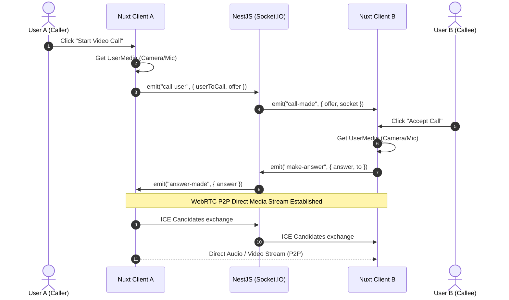

<p align="center">
  
</p>

<h1 align="center">ChitChat</h1>

<p align="center">A real-time communication platform enabling instant messaging, room-based chat, and peer-to-peer audio/video calls built with Nuxt 3, NestJS, WebSockets, and WebRTC.</p>

## ✨ Features

- **Real-Time Messaging** — Instant bidirectional chat using Socket.IO events and room subscriptions.
- **WebRTC Audio & Video Calls** — High-quality peer-to-peer audio and video communication with SDP offer/answer signaling and ICE candidate exchange over WebSockets.
- **Chat Room Management** — Create, join, and manage custom chatrooms with persistence powered by MongoDB.
- **JWT Authentication** — User registration and login secured with JWT authentication tokens.
- **Nuxt 3 SSR Frontend** — Modern reactive user interface built with Vue 3, Nuxt 3, and Tailwind CSS.
- **NestJS Modular Backend** — Scalable backend microservices structure using NestJS, Mongoose, and Swagger API documentation.
- **Dockerized Infrastructure** — Containerized full-stack deployment using Docker Compose orchestrating Client, Server, and MongoDB.

## 📡 WebRTC & Signaling Architecture

The diagram below illustrates how client peers exchange WebSockets signaling messages via NestJS to establish a direct WebRTC peer-to-peer audio/video media stream:



## 📦 Application Stack & Ports

| Service | Component | Port | Description |
|---|---|---|---|
| **Client** | Nuxt 3 + Vue 3 | `3001` (host) / `3000` (container) | Frontend web application UI |
| **Server** | NestJS | `3000` | REST API, Swagger docs (`/api/docs`), Socket.IO Gateway |
| **Database** | MongoDB 7 | `27017` | Persistent data store for Users, Rooms, and Messages |

## Prerequisites

- [Docker](https://docs.docker.com/get-docker/) and Docker Compose
- Node.js **20+** and npm (if running locally without Docker)
- Modern Web Browser supporting WebRTC (Chrome, Firefox, Safari, Edge)
- Camera & Microphone permissions for audio/video calling features

## Quick Start

```bash
# 1. Clone the repository
git clone https://github.com/ttncode/chitchat.git
cd chitchat

# 2. Run the environment setup script
./init-env.sh

# 3. Start the entire application fleet using Docker Compose
docker compose up -d --build
```

Once running:
- Open the frontend in your browser: `http://localhost:3001`
- Access the NestJS REST API / Swagger documentation: `http://localhost:3000/api/docs`

## Environment Variables

### Server (`server/.env`)
| Variable | Default | Description |
|---|---|---|
| `PORT` | `3000` | Server listening port |
| `MONGODB_URI` | `mongodb://mongo:27017/chitchat` | MongoDB connection string |
| `JWT_SECRET` | `chitchat_jwt_secret_key` | Secret key used to sign JWT authentication tokens |

### Client (`client/.env`)
| Variable | Default | Description |
|---|---|---|
| `NUXT_PUBLIC_API_BASE` | `http://localhost:3000` | NestJS backend REST API URL |
| `NUXT_PUBLIC_SOCKET_URL` | `http://localhost:3000` | NestJS Socket.IO WebSocket URL |

## Docker Volumes

| Volume | Mount Path | Purpose |
|---|---|---|
| `mongo_data` | `/data/db` | Persists MongoDB user accounts, chatrooms, and message history |

## Development

To run the client and server locally without Docker:

```bash
# Terminal 1: Start NestJS Backend
cd server
npm install
npm run start:dev

# Terminal 2: Start Nuxt 3 Frontend
cd client
npm install
npm run dev
```

## Tech Stack

Nuxt 3 · Vue 3 · NestJS · Socket.IO · WebRTC · MongoDB · Mongoose · Tailwind CSS · Docker · Docker Compose
